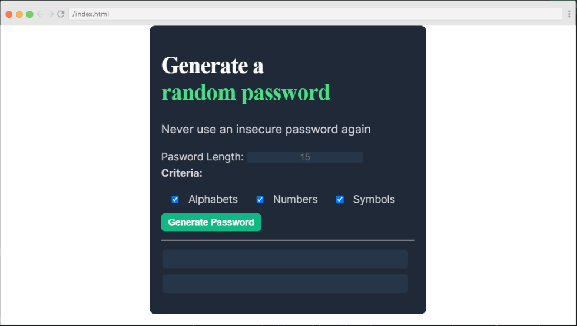
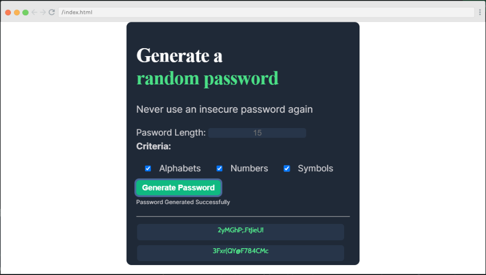
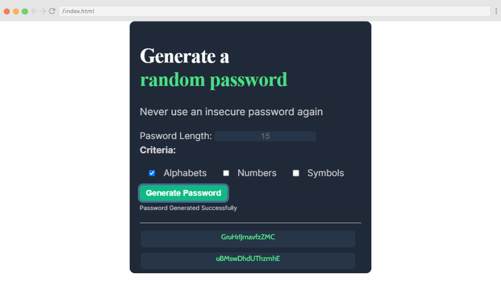

# Project: Password Generator

## Description:
It is a type of web application which can be used to generate password based upon different criteria like what will be the length of generated password, whether password should contain letters, numbers or symbols etc.  It is created using HTML, CSS, and JavaScript.

## Features:
- It can be used to generate password of default criterial
- generate based upon specified length
- can generate passwords based upon criteria between letters, numbers, symbols
- show the status of password generation
- guide user through hints

## Output:

Happy Coding!